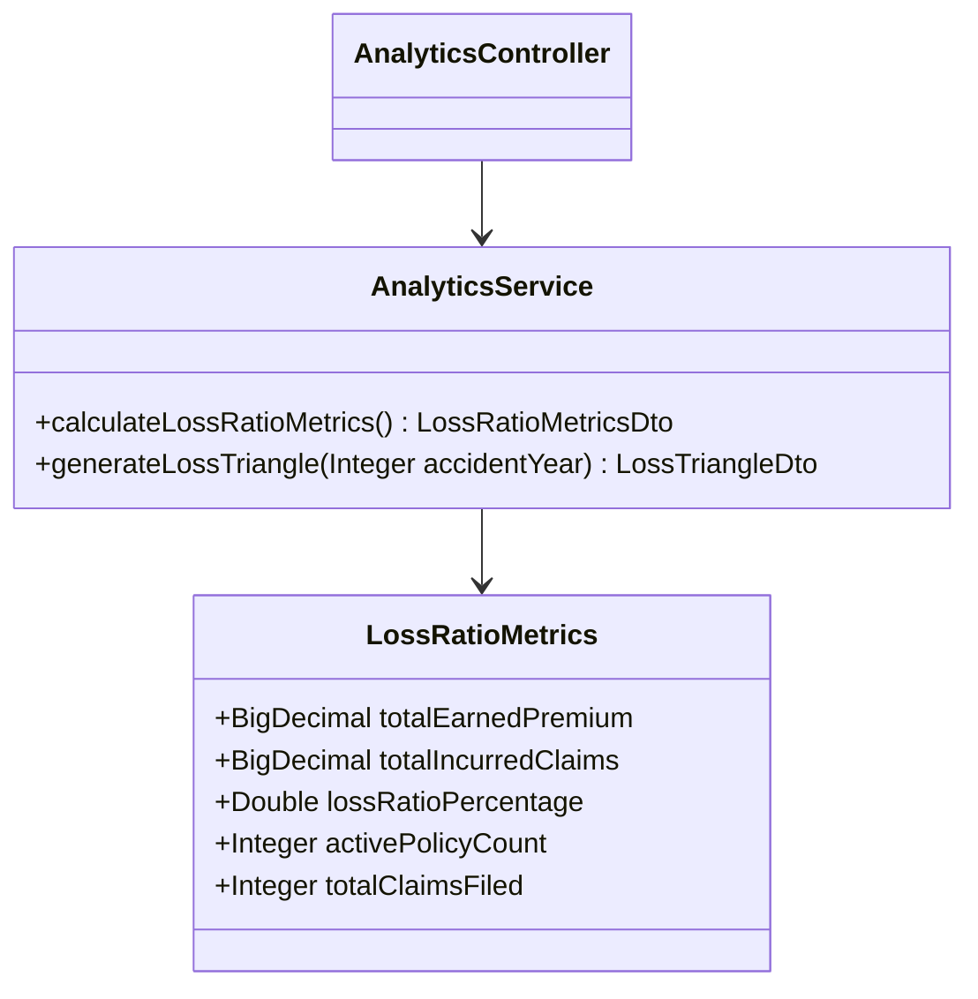
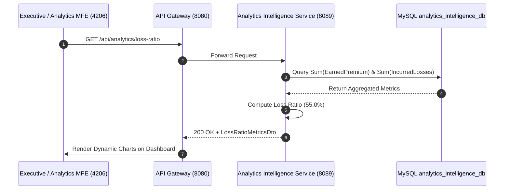

# Analytics & Intelligence Service - Technical & Flow Documentation

> **Service Name**: `analytics-intelligence-service`  
> **Eureka Application Name**: `ANALYTICS-INTELLIGENCE-SERVICE`  
> **Port**: `8089`  
> **Framework**: Spring Boot 3.x, Analytics Aggregation Engine, Spring Data JPA, Java 17  
> **Database**: `analytics_intelligence_db` (MySQL)

---

## 1. Startup & Execution Guide (No Docker)

To run the Analytics & Intelligence Service natively using Maven:

```bash
# Navigate to analytics-intelligence-service directory
cd /Users/gouthamlingoju/Projects/IntelliSure/analytics-intelligence-service

# Clean and run service
./mvnw spring-boot:run
```

- **Base URL**: `http://localhost:8089`
- **Health Check Endpoint**: [http://localhost:8089/actuator/health](http://localhost:8089/actuator/health)

---

## 2. Business Logic & Core Responsibilities

The `analytics-intelligence-service` powers executive reporting, underwriting loss ratio analysis, actuarial loss triangle modeling, and risk score distribution dashboards.

### Key Responsibilities:
1. **Loss Ratio Aggregation**: Computes Loss Ratio metric:  
   $$\text{Loss Ratio (\%)} = \left(\frac{\text{Incurred Claims Losses} + \text{Loss Adjustment Expenses}}{\text{Earned Premium}}\right) \times 100$$
2. **Actuarial Loss Triangles**: Generates accident-year vs. development-year loss triangle matrices for actuarial reserving.
3. **Executive Dashboard Feeds**: Provides real-time metrics for Analytics Microfrontend (`http://localhost:4206`) charts (Total Written Premium, Claims Frequency, Net Subrogation Yield).

---

## 3. Technical Architecture & Class Diagrams



---

## 4. REST API Specifications

| Endpoint Path | HTTP Method | Response Body DTO |
| :--- | :---: | :--- |
| `/api/analytics/loss-ratio` | `GET` | `LossRatioMetricsDto` |
| `/api/analytics/loss-triangle/{year}` | `GET` | `LossTriangleDto` |
| `/api/analytics/dashboard/summary` | `GET` | `ExecutiveDashboardSummaryDto` |

---

## 5. End-to-End Analytics Flow

1. Executive opens Analytics MFE (`http://localhost:4206`).
2. MFE sends request `GET /api/analytics/loss-ratio` to API Gateway (`8080`).
3. `analytics-intelligence-service` queries `analytics_intelligence_db` for aggregated policy premiums and claim payouts.
4. Calculates Loss Ratio: e.g., Total Incurred Losses ($5,500,000) / Total Earned Premium ($10,000,000) = **`55.0%`**.
5. Returns metrics JSON payload to Angular Chart.js component for visual rendering.

---

## 6. Mermaid Sequence Diagram


