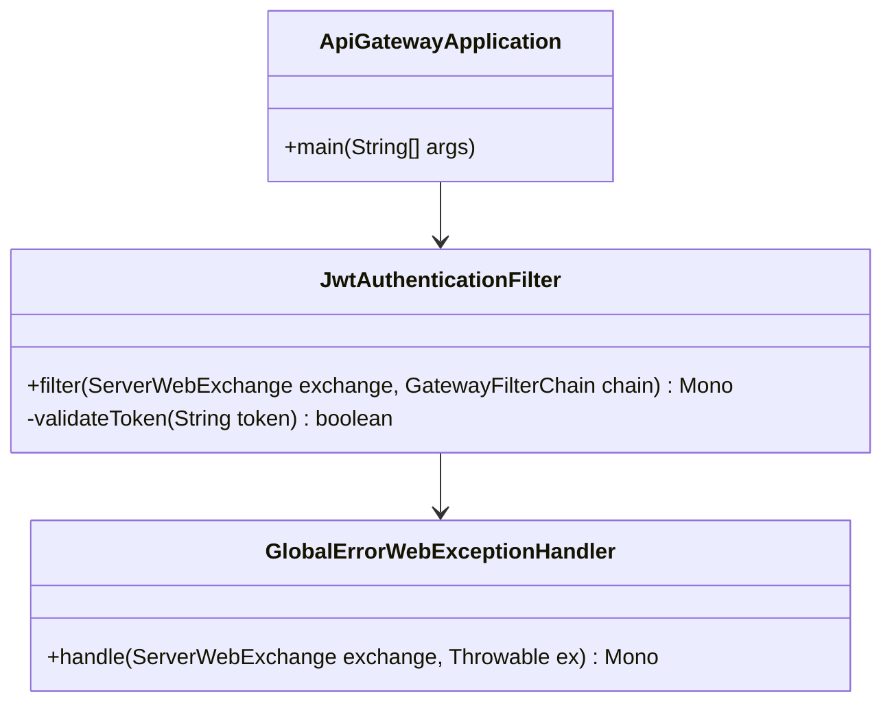
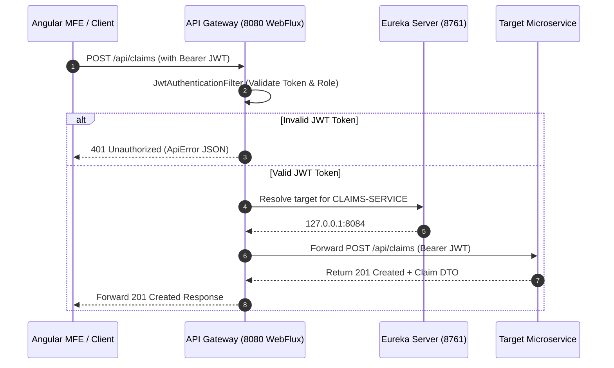

# API Gateway Service - Technical & Flow Documentation

> **Service Name**: `api-gateway`  
> **Eureka Application Name**: `API-GATEWAY`  
> **Port**: `8080`  
> **Framework**: Spring Boot 4.1.1, Spring Cloud Gateway, **Spring WebFlux (Reactive Stack)**, Java 17
> **Database**: N/A (Stateless Gateway Router)

---

## 1. Startup & Execution Guide (No Docker)

To run the API Gateway natively using Maven:

```bash
# Navigate to api-gateway directory
cd /Users/gouthamlingoju/Projects/IntelliSure/api-gateway

# Clean and run service
./mvnw spring-boot:run
```

- **Gateway Base URL**: `http://localhost:8080`
- **Health Check Endpoint**: [http://localhost:8080/actuator/health](http://localhost:8080/actuator/health)

---

## 2. Business Logic & Core Responsibilities

The `api-gateway` serves as the single unified entry point for all frontend client applications (Angular Microfrontends, Mobile Apps, Third-party APIs).

### Key Responsibilities:
1. **Unified API Gateway Routing**: Routes external requests (`/api/v1/...`) to internal microservices registered in Eureka using `lb://<SERVICE-NAME>` dynamic load balancing.
2. **Reactive Security & JWT Validation**: Uses custom WebFlux reactive filters (`AuthenticationWebFilter`) to inspect HTTP `Authorization: Bearer <token>` headers and validate HMAC-SHA256 signatures. The original Bearer token is propagated to downstream services for their own fine-grained ownership checks.
3. **CORS Centralization**: Handles Cross-Origin Resource Sharing (CORS) preflight requests for Angular Microfrontends (`http://localhost:4200` to `4206`).
4. **Global Exception Handling**: Converts unhandled downstream network or routing errors into standardized `ApiError` JSON responses.

---

## 3. Technical Architecture & Advanced Paradigms

> [!TIP]
> **Extra Evaluation Positive Remark - Spring WebFlux Reactive Paradigm**:  
> The API Gateway is built on **Spring WebFlux** and **Netty**, enabling non-blocking, event-driven reactive request processing capable of handling tens of thousands of concurrent client connections with minimal CPU and memory footprint.

### Package Architecture & Key Classes:
- `com.intellisure.apigateway.config.GatewayConfig`: Defines reactive routes and locator settings.
- `com.intellisure.apigateway.filter.JwtAuthenticationFilter`: Custom reactive `GatewayFilter` validating JWT tokens non-blockingly.
- `com.intellisure.apigateway.exception.GlobalErrorWebExceptionHandler`: Reactive custom error handler for gateway errors.



---

## 4. End-to-End Route Table Matrix

| External Path Pattern | Target Eureka Service ID | Service Port | Security Level | Roles Allowed |
| :--- | :--- | :---: | :--- | :--- |
| `/api/auth/**` | `lb://CUSTOMER-PARTY-SERVICE` | `8081` | Public | All |
| `/api/customers/**` | `lb://CUSTOMER-PARTY-SERVICE` | `8081` | Authenticated | `CUSTOMER`, `ADMIN` |
| `/api/quotes/**` | `lb://QUOTE-POLICY-SERVICE` | `8082` | Authenticated | `CUSTOMER`, `AGENT`, `UNDERWRITER` |
| `/api/policies/**` | `lb://QUOTE-POLICY-SERVICE` | `8082` | Authenticated | `CUSTOMER`, `AGENT`, `ADMIN` |
| `/api/risk/**` | `lb://RISK-UNDERWRITING-SERVICE` | `8083` | Authenticated | `UNDERWRITER`, `ADMIN` |
| `/api/claims/**` | `lb://CLAIMS-SERVICE` | `8084` | Authenticated | `CUSTOMER`, `ADJUSTER`, `ADMIN` |
| `/api/vendors/**` | `lb://VENDOR-PARTNER-SERVICE` | `8085` | Authenticated | `VENDOR`, `ADJUSTER`, `ADMIN` |
| `/api/recovery/**` | `lb://RECOVERY-SERVICE` | `8086` | Authenticated | `ADJUSTER`, `RECOVERY_OFFICER`, `ADMIN` |
| `/api/notifications/**`| `lb://WORKFLOW-NOTIFICATION-SERVICE`| `8087` | Authenticated | All |
| `/api/documents/**` | `lb://DOCUMENT-AUDIT-SERVICE` | `8088` | Authenticated | All |
| `/api/analytics/**` | `lb://ANALYTICS-INTELLIGENCE-SERVICE`| `8089` | Authenticated | `EXECUTIVE`, `ADMIN` |

---

## 5. End-to-End Step-by-Step Security & Routing Flow

### Flow 1: Reactive JWT Validation & Forwarding
1. User sends `POST /api/quotes` with header `Authorization: Bearer eyJhbGci...`.
2. `JwtAuthenticationFilter` intercepts request in non-blocking event loop.
3. Decodes JWT token using secret key; verifies expiration and HMAC signature.
4. Extracts claims for coarse gateway authorization.
5. Preserves the authenticated Bearer token and correlation ID while forwarding the request.
6. Target microservice validates the propagated JWT and performs its own ownership and role checks.

---

## 6. Mermaid Sequence Diagram


