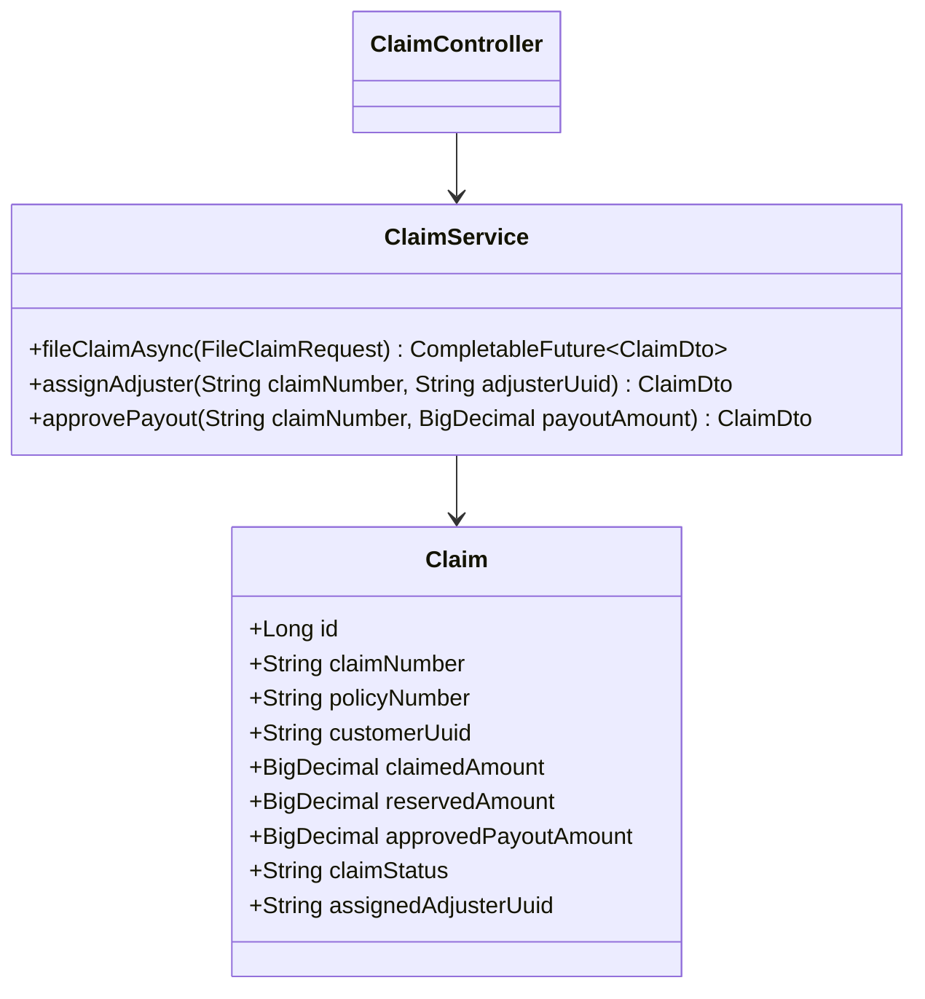
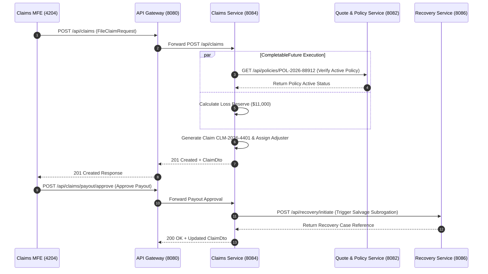

# Claims Service - Technical & Flow Documentation

> **Service Name**: `claims-service`  
> **Eureka Application Name**: `CLAIMS-SERVICE`  
> **Port**: `8084`  
> **Framework**: Spring Boot 4.1.1, Spring WebFlux, Spring Data R2DBC, Java 17
> **Database**: `claims_db` (MySQL)

---

## 1. Startup & Execution Guide (No Docker)

To run the Claims Service natively using Maven:

```bash
# Navigate to claims-service directory
cd /Users/gouthamlingoju/Projects/IntelliSure/claims-service

# Clean and run service
./mvnw spring-boot:run
```

- **Base URL**: `http://localhost:8084`
- **Health Check Endpoint**: [http://localhost:8084/actuator/health](http://localhost:8084/actuator/health)

---

## 2. Business Logic & Core Responsibilities

The `claims-service` handles First Notice of Loss (FNOL), claim verification, adjuster assignment, loss reserve calculations, payout approvals, and claim closure.

### Key Responsibilities:
1. **First Notice of Loss (FNOL) Registration**: Receives claims filed by policyholders, validating active policy status with `quote-policy-service`.
2. **CompletableFuture Loss Reserve Calculation**: Computes financial loss reserves concurrently using `CompletableFuture` based on loss damage tier and policy coverage caps.
3. **Automated Adjuster Assignment**: Assigns an available licensed claims adjuster based on geographic region and workload capacity.
4. **Claim Settlement & Payout Authorization**: Manages claim adjudication stages (`FILED` -> `UNDER_INVESTIGATION` -> `APPROVED` -> `SETTLED`). If damage exceeds 75% of vehicle market value, automatically triggers subrogation recovery in `recovery-service`.

---

## 3. Technical Architecture & Advanced Paradigms

> [!TIP]
> **Extra Evaluation Positive Remark - CompletableFuture Adjudication Engine**:  
> Upon claim submission, `claims-service` executes `CompletableFuture.supplyAsync()` to parallelize policy active status verification, adjuster workload matching, and initial loss reserve modeling, returning instant FNOL claim reference numbers to the customer.

### Class Architecture:
- `com.intellisure.claimsservice.entity.Claim`: JPA entity mapping `claims_db.claims`.
- `com.intellisure.claimsservice.service.ClaimService`: Adjudication workflow service.
- `com.intellisure.claimsservice.controller.ClaimController`: REST controller for `/api/claims`.



---

## 4. REST API Specifications

| Endpoint Path | HTTP Method | Request Body DTO | Response Body DTO | Concurrency Model |
| :--- | :---: | :--- | :--- | :---: |
| `/api/claims` | `POST` | `FileClaimRequest` | `ClaimDto` | `CompletableFuture` Async |
| `/api/claims/{claimNumber}` | `GET` | N/A | `ClaimDto` | Synchronous JPA |
| `/api/claims/adjuster/assign` | `PUT` | `AssignAdjusterDto` | `ClaimDto` | Synchronous JPA |
| `/api/claims/payout/approve` | `POST` | `PayoutApprovalDto` | `ClaimDto` | Synchronous JPA + Inter-service |

---

## 5. End-to-End Step-by-Step User Journey

### Flow 1: Claim Filing, Reserve Calculation & Adjuster Assignment
1. Policyholder files auto collision claim ($12,000 damage) on Claims MFE (`http://localhost:4204`).
2. API Gateway (`8080`) routes request to `claims-service` (`8084`).
3. `ClaimService` initiates `CompletableFuture`:
   - Checks active policy status in `quote-policy-service`.
   - Calculates initial loss reserve ($12,000 minus $1,000 deductible = $11,000 reserve).
   - Queries nearest available adjuster in region.
4. Claim saved with status `UNDER_INVESTIGATION` and claim number `CLM-2026-4401`.
5. Adjuster inspects vehicle, approves payout of $11,000.
6. If total loss declared -> Service dispatches total-loss alert to `recovery-service` (`8086`) for salvage auction.

---

## 6. Mermaid Sequence Diagram


