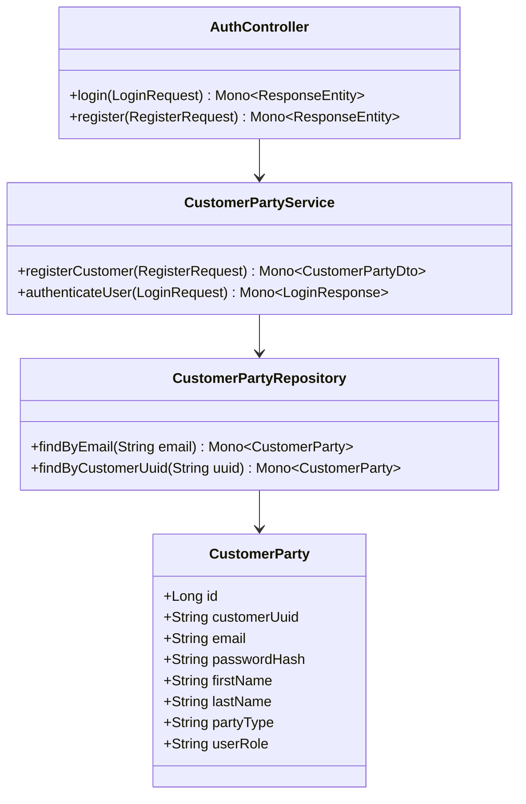
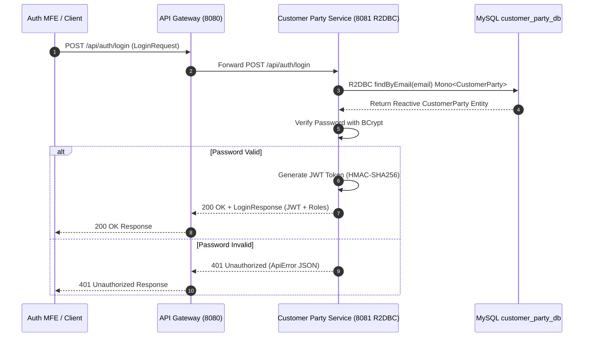

# Customer Party Service - Technical & Flow Documentation

> **Service Name**: `customer-party-service`  
> **Eureka Application Name**: `CUSTOMER-PARTY-SERVICE`  
> **Port**: `8081`  
> **Framework**: **Spring WebFlux (Reactive Stack)**, **R2DBC (Reactive Relational Database Connectivity)**, Java 17  
> **Database**: `customer_party_db` (MySQL / R2DBC)

---

## 1. Startup & Execution Guide (No Docker)

To run the Customer Party Service natively using Maven:

```bash
# Navigate to customer-party-service directory
cd /Users/gouthamlingoju/Projects/IntelliSure/customer-party-service

# Clean and run service
./mvnw spring-boot:run
```

- **Base URL**: `http://localhost:8081`
- **Health Check Endpoint**: [http://localhost:8081/actuator/health](http://localhost:8081/actuator/health)

---

## 2. Business Logic & Core Responsibilities

The `customer-party-service` is responsible for managing customer identities, party roles (Individual Customer, Business Entity, Agent, Underwriter, Adjuster, Vendor), authentication credentials, and customer profile details.

### Key Responsibilities:
1. **User Self-Registration**: Enables new individual and commercial customers to create accounts with reactive validation.
2. **Reactive Authentication & JWT Token Issuance**: Authenticates users using BCrypt password verification and issues signed JWT tokens containing user roles.
3. **Party Profile Management**: Maintains customer demographics, address records, contact channels, and policyholder relationships.
4. **Role-Based Identity Management**: Controls access tiers (`CUSTOMER`, `AGENT`, `UNDERWRITER`, `ADJUSTER`, `VENDOR`, `ADMIN`).

---

## 3. Technical Architecture & Advanced Paradigms

> [!TIP]
> **Extra Evaluation Positive Remark - Spring WebFlux & R2DBC Reactive Stack**:  
> Unlike traditional blocking JPA microservices, `customer-party-service` implements **Spring WebFlux** and **R2DBC**. Database queries return non-blocking `Mono<T>` and `Flux<T>` streams, allowing authentication and profile reads to handle massive concurrent traffic without thread starvation.

### Class & Entity Structure:
- `com.intellisure.customerpartyservice.entity.CustomerParty`: Entity mapping `customer_party_db.customers`.
- `com.intellisure.customerpartyservice.repository.CustomerPartyRepository`: `R2dbcRepository<CustomerParty, Long>`.
- `com.intellisure.customerpartyservice.service.CustomerPartyService`: Reactive business logic returning `Mono<CustomerPartyDto>`.
- `com.intellisure.customerpartyservice.controller.AuthController`: WebFlux controller exposing `/api/auth/login` and `/api/auth/register`.



---

## 4. REST API & DTO Specifications

| Endpoint Path | HTTP Method | Request Body DTO | Response Body DTO | Reactive Stream |
| :--- | :---: | :--- | :--- | :---: |
| `/api/auth/register` | `POST` | `RegisterRequest` | `CustomerPartyDto` | `Mono<CustomerPartyDto>` |
| `/api/auth/login` | `POST` | `LoginRequest` | `LoginResponse` | `Mono<LoginResponse>` |
| `/api/customers/{uuid}` | `GET` | N/A | `CustomerPartyDto` | `Mono<CustomerPartyDto>` |
| `/api/customers` | `GET` | N/A | `List<CustomerPartyDto>` | `Flux<CustomerPartyDto>` |

---

## 5. End-to-End Step-by-Step User Journey

### Flow 1: Customer Registration & JWT Acquisition
1. New customer submits registration details (Name, Email, Password, SSN/Tax ID) on Auth Microfrontend (`http://localhost:4201`).
2. Request hits API Gateway (`8080`) -> Routed to `customer-party-service` (`8081`).
3. `CustomerPartyService.registerCustomer()` checks if email exists using `findByEmail()` (`Mono<Boolean>`).
4. Password is hashed asynchronously using `BCryptPasswordEncoder`.
5. Customer record is persisted via R2DBC (`Mono<CustomerParty>`).
6. User logs in with email and password -> Service generates JWT token valid for 24 hours.
7. Frontend stores JWT token in NgRx Auth Store for all subsequent microservice requests.

---

## 6. Mermaid Sequence Diagram


