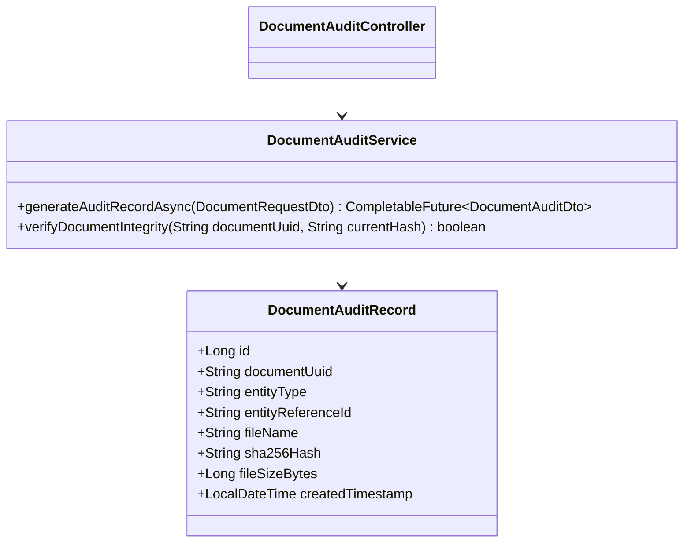
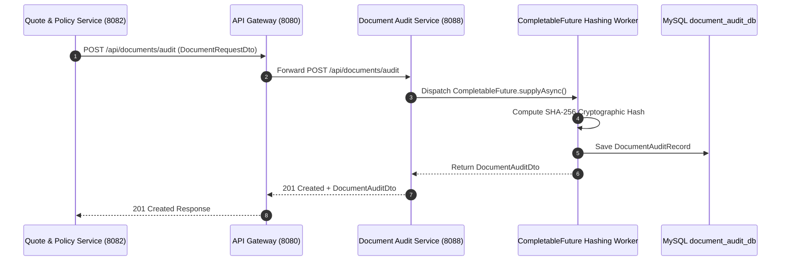

# Document Audit Service - Technical & Flow Documentation

> **Service Name**: `document-audit-service`  
> **Eureka Application Name**: `DOCUMENT-AUDIT-SERVICE`  
> **Port**: `8088`  
> **Framework**: Spring Boot 4.1.1, Spring WebFlux, Spring Data R2DBC, Java 17
> **Database**: `document_audit_db` (MySQL)

---

## 1. Startup & Execution Guide (No Docker)

To run the Document Audit Service natively using Maven:

```bash
# Navigate to document-audit-service directory
cd /Users/gouthamlingoju/Projects/IntelliSure/document-audit-service

# Clean and run service
./mvnw spring-boot:run
```

- **Base URL**: `http://localhost:8088`
- **Health Check Endpoint**: [http://localhost:8088/actuator/health](http://localhost:8088/actuator/health)

---

## 2. Business Logic & Core Responsibilities

The `document-audit-service` indexes policy documents, claim evidence files, and underwriting approvals, enforcing tamper-proof SHA-256 cryptographic audit logs.

### Key Responsibilities:
1. **Cryptographic SHA-256 Hashing Engine**: Generates immutable SHA-256 checksum hashes for policy contracts and claim photos to guarantee non-repudiation and prevent document tampering.
2. **CompletableFuture Concurrent Hashing**: Calculates cryptographic digests for multi-file attachments concurrently using `CompletableFuture`.
3. **Regulatory Audit Trail**: Maintains timestamped audit trails of document creation, modification, and verification events.
4. **Document Integrity Verification**: Compares stored SHA-256 hashes against re-submitted files to verify file authenticity during legal or regulatory reviews.

---

## 3. Technical Architecture & Advanced Paradigms

> [!TIP]
> **Extra Evaluation Positive Remark - CompletableFuture SHA-256 Cryptographic Engine**:  
> Cryptographic hashing of large PDF contracts and high-resolution claim images can be CPU-intensive. `document-audit-service` offloads byte-stream hashing to multi-threaded worker pools via `CompletableFuture.supplyAsync()`, ensuring high throughput document processing.

### Class Architecture:
- `com.intellisure.documentauditservice.entity.DocumentAuditRecord`: JPA entity storing document metadata, SHA-256 hashes, and audit timestamps.
- `com.intellisure.documentauditservice.service.DocumentAuditService`: Cryptographic hash calculation service.
- `com.intellisure.documentauditservice.controller.DocumentAuditController`: REST controller for `/api/documents`.



---

## 4. REST API Specifications

| Endpoint Path | HTTP Method | Request Body DTO | Response Body DTO | Concurrency Model |
| :--- | :---: | :--- | :--- | :---: |
| `/api/documents/audit` | `POST` | `DocumentRequestDto` | `DocumentAuditDto` | `CompletableFuture` Async |
| `/api/documents/verify/{documentUuid}` | `POST` | `VerifyHashDto` | `VerificationResultDto` | Synchronous JPA |
| `/api/documents/entity/{entityRefId}` | `GET` | N/A | `List<DocumentAuditDto>` | Synchronous JPA |

---

## 5. End-to-End Step-by-Step Audit Flow

1. `quote-policy-service` generates Policy Contract PDF for `POL-2026-88912`.
2. Sends HTTP `POST /api/documents/audit` with document binary payload.
3. `DocumentAuditService` initiates `CompletableFuture`:
   - Computes SHA-256 hash digest (e.g. `e3b0c44298fc1c149afbf4c8996fb92427ae41e4649b934ca495991b7852b855`).
   - Persists audit record to `document_audit_db`.
4. Returns audit reference DTO.
5. In case of legal dispute, auditor submits document for verification -> System re-hashes payload and compares against stored SHA-256 hash. Returns `VERIFIED_INTACT` or `TAMPERED_MISMATCH`.

---

## 6. Mermaid Sequence Diagram


