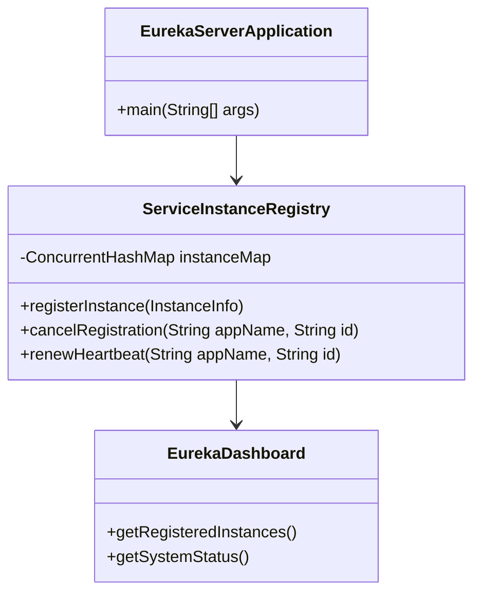
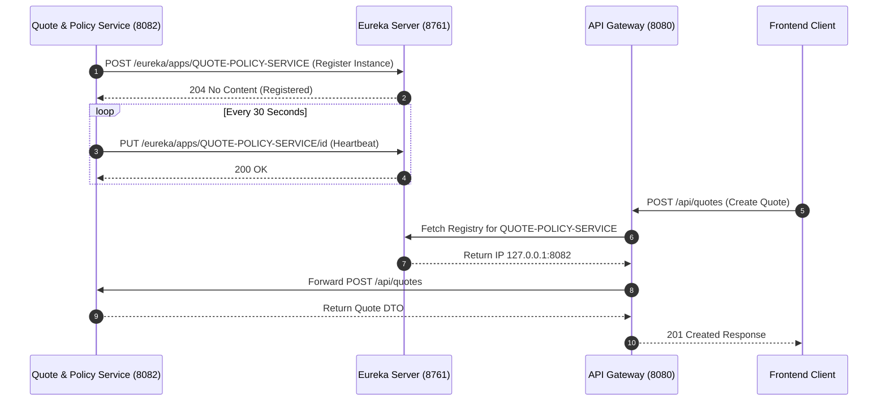

# Eureka Service Discovery - Technical & Flow Documentation

> **Service Name**: `eureka`  
> **Eureka Application Name**: `EUREKA-SERVER`  
> **Port**: `8761`  
> **Framework**: Spring Cloud Netflix Eureka Server (Spring Boot 3.x, Java 17)  
> **Database**: N/A (In-Memory Discovery Registry)

---

## 1. Startup & Execution Guide (No Docker)

To run the Eureka Discovery Server natively using Maven:

```bash
# Navigate to Eureka directory
cd /Users/gouthamlingoju/Projects/IntelliSure/eureka

# Clean and run service
./mvnw spring-boot:run
```

- **Eureka Web Dashboard**: [http://localhost:8761](http://localhost:8761)
- **Health Check Endpoint**: [http://localhost:8761/actuator/health](http://localhost:8761/actuator/health)

---

## 2. Business Logic & Core Responsibilities

The `eureka` server acts as the central service discovery registry for the entire IntelliSure microservices ecosystem. 

### Key Responsibilities:
1. **Dynamic Service Registration**: Receives heartbeat registrations from all 10 downstream microservices (`api-gateway`, `customer-party-service`, `quote-policy-service`, `risk-underwriting-service`, `claims-service`, `vendor-partner-service`, `recovery-service`, `workflow-notification-service`, `document-audit-service`, `analytics-intelligence-service`).
2. **Dynamic Service Resolution**: Enables client-side load balancing and dynamic dynamic host resolution for `api-gateway` and inter-service Feign/WebClient communication without hardcoded IP addresses.
3. **Heartbeat Monitoring & Self-Preservation**: Monitors instance health via 30-second heartbeat ping cycles. EVicts unhealthy instances automatically if heartbeats fail.

---

## 3. Technical Architecture & Component Structure



---

## 4. End-to-End Step-by-Step Discovery Flows

### Flow 1: Service Bootstrapping & Registration
1. Downstream microservice (e.g., `quote-policy-service`) boots up on port `8082`.
2. Microservice reads `eureka.client.service-url.defaultZone=http://localhost:8761/eureka/`.
3. Sends HTTP `POST /eureka/apps/QUOTE-POLICY-SERVICE` containing instance IP, port, health check URL, and metadata.
4. `eureka` registers instance into `ServiceInstanceRegistry` map and logs instance registration.
5. Instance appears on Eureka Dashboard at `http://localhost:8761`.

### Flow 2: Dynamic Gateway Routing
1. Client sends request to `http://localhost:8080/api/quotes/create`.
2. `api-gateway` extracts route rule `lb://QUOTE-POLICY-SERVICE`.
3. `api-gateway` queries Eureka local cache for active instances of `QUOTE-POLICY-SERVICE`.
4. Eureka returns host `127.0.0.1:8082`.
5. Gateway proxies request to `http://127.0.0.1:8082/api/quotes/create`.

---

## 5. Mermaid Sequence Diagram


