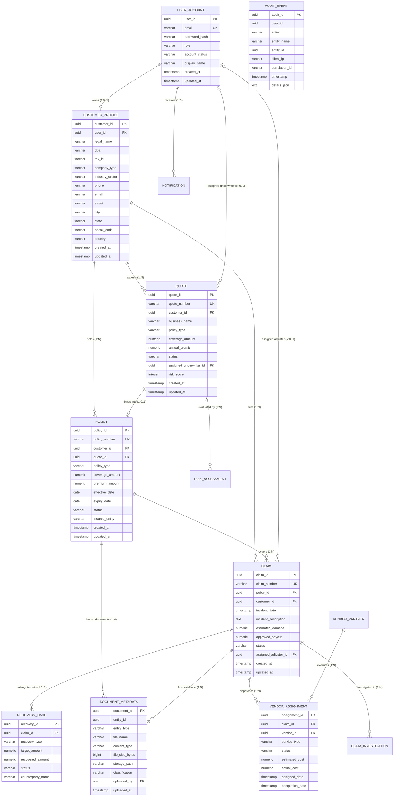
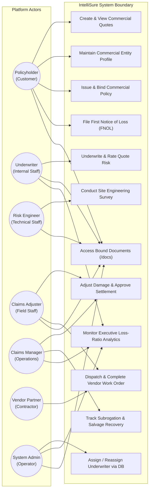
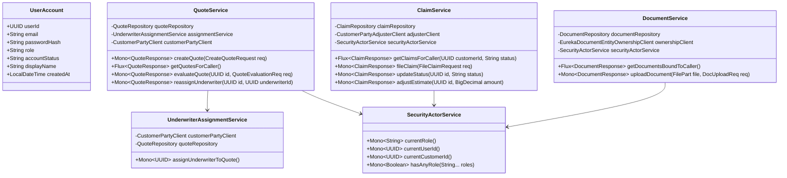
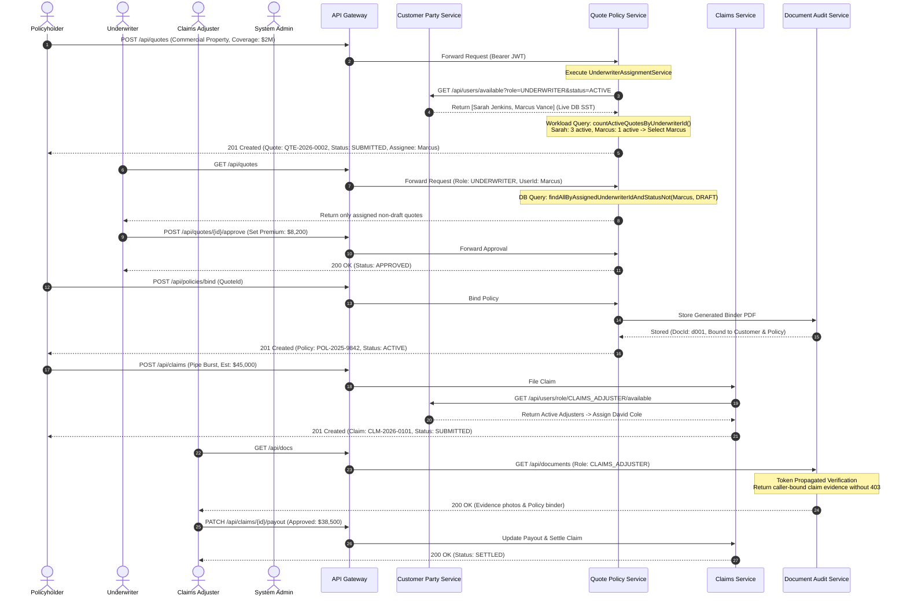

<style>
  body {
    font-family: -apple-system, BlinkMacSystemFont, "Segoe UI", Roboto, "Helvetica Neue", Arial, sans-serif;
    font-size: 11pt;
    line-height: 1.65;
    color: #1f2937;
    text-align: justify;
  }
  h1 { font-size: 26pt; font-weight: 800; color: #0f172a; text-align: left; border-bottom: 3px solid #2563eb; padding-bottom: 12px; margin-top: 28pt; page-break-before: always; }
  h1.no-break { page-break-before: avoid; margin-top: 0; }
  h2 { font-size: 18pt; font-weight: 700; color: #1e3a8a; text-align: left; border-bottom: 1px solid #cbd5e1; padding-bottom: 6px; margin-top: 22pt; page-break-after: avoid; }
  h3 { font-size: 13.5pt; font-weight: 600; color: #1e40af; text-align: left; margin-top: 16pt; page-break-after: avoid; }
  h4 { font-size: 11.5pt; font-weight: 600; color: #334155; text-align: left; margin-top: 12pt; page-break-after: avoid; }
  p, li { text-align: justify; }
  table { width: 100%; border-collapse: collapse; margin: 18px 0; page-break-inside: avoid; font-size: 9.5pt; }
  th, td { border: 1px solid #cbd5e1; padding: 9px 12px; vertical-align: top; }
  th { background-color: #f1f5f9; color: #0f172a; font-weight: 700; text-align: left; }
  tr:nth-child(even) { background-color: #f8fafc; }
  pre { background-color: #0f172a; color: #f8fafc; padding: 14px; border-radius: 6px; overflow-x: auto; font-size: 9pt; line-height: 1.45; page-break-inside: avoid; }
  code { font-family: "SFMono-Regular", Consolas, "Liberation Mono", Menlo, Courier, monospace; font-size: 9.5pt; background-color: #f1f5f9; padding: 2px 5px; border-radius: 4px; color: #0f172a; }
  pre code { background-color: transparent; padding: 0; color: inherit; font-size: inherit; }
  blockquote { border-left: 4px solid #2563eb; padding: 10px 18px; background-color: #f8fafc; color: #334155; margin: 18px 0; border-radius: 0 6px 6px 0; page-break-inside: avoid; }
  .badge { display: inline-block; padding: 2px 8px; font-size: 8.5pt; font-weight: 600; border-radius: 9999px; }
  .badge-get { background-color: #dbeafe; color: #1e40af; }
  .badge-post { background-color: #dcfce7; color: #15803d; }
  .badge-put { background-color: #fef3c7; color: #b45309; }
  .badge-patch { background-color: #f3e8ff; color: #6b21a8; }
  .badge-delete { background-color: #fee2e2; color: #b91c1c; }
  @page { margin: 20mm 18mm 20mm 18mm; size: A4; }
</style>

<h1 class="no-break">IntelliSure Enterprise Platform Specification</h1>

**Document Version:** 2.4.0  
**Target Environment:** Production / Multi-Cloud Enterprise  
**Architecture Classification:** Reactive Microservices & Federated Microfrontends  
**Last Updated:** October 2026  
**Classification:** Confidential — Internal Technical & Business Architecture  

---

## 1. Abstract

The **IntelliSure** platform is a cloud-native, reactive commercial insurance management system designed to support the entire policyholder and carrier lifecycle. Commercial property and casualty insurance operations are traditionally hampered by siloed policy administration systems, manual underwriting handoffs, rigid claim adjudication queues, and fragmented third-party vendor coordination. IntelliSure addresses these systemic bottlenecks by implementing a decoupled, domain-driven microservices architecture backed by non-blocking reactive pipelines (Spring WebFlux, Project Reactor, R2DBC) and an enterprise Angular 17 Module Federation frontend.

The platform provides end-to-end support for multi-line commercial quoting, dynamic algorithmic underwriter assignment with real-time workload balancing, technical risk engineering site inspections, policy issuance, FNOL (First Notice of Loss) claim filing, loss damage estimation, vendor dispatch, subrogation recovery, and real-time executive loss-ratio intelligence. Security and regulatory compliance are guaranteed across all distributed boundaries via cryptographic JSON Web Tokens (JWT), role-based access control (RBAC), caller-bound data segregation, immutable audit logging, and automated end-to-end verification.

---

## 2. System Architecture & Microservices

IntelliSure follows a distributed, event-tolerant, reactive microservices architecture. High scalability, resilient fault isolation, and sub-100ms API response times are achieved through non-blocking asynchronous I/O across both the client-edge tier and the internal service mesh.

```mermaid
flowchart TB
    subgraph ClientTier ["Frontend Presentation Layer (Module Federation)"]
        Shell["Angular 17 Shell Application\n(Port 4200)"]
        AuthMFE["Auth MFE\n(Port 4201)"]
        ClaimsMFE["Claims MFE\n(Port 4202)"]
        IntelMFE["Intelligence MFE\n(Port 4203)"]
        VendorMFE["Vendor MFE\n(Port 4205)"]
        UICore["Shared UI-Core Library\n(Design System Primitives)"]
        
        Shell --> AuthMFE
        Shell --> ClaimsMFE
        Shell --> IntelMFE
        Shell --> VendorMFE
        Shell -.-> UICore
    end

    subgraph EdgeTier ["API Gateway & Discovery Layer"]
        Gateway["Spring Cloud Gateway\n(Port 8080)\n- Non-Blocking WebFlux\n- JWT Authentication & RBAC\n- Rate Limiting & Correlation ID"]
        Eureka["Netflix Eureka Server\n(Port 8761)\nDynamic Service Registry"]
    end

    subgraph ServiceMesh ["Reactive Microservices Tier (Spring WebFlux 4.1.1)"]
        CPS["Customer Party Service\n(Port 8081)\nUser Accounts & SST Employee Discovery"]
        QPS["Quote Policy Service\n(Port 8082)\nQuotes, Workload Balancing & Policies"]
        CS["Claims Service\n(Port 8083)\nFNOL, Adjudication & Adjuster Workflow"]
        RUS["Risk Underwriting Service\n(Port 8084)\nEngineering Surveys & AI Risk Evaluation"]
        VPS["Vendor Partner Service\n(Port 8085)\nOnboarding, Network & Work Orders"]
        DAS["Document Audit Service\n(Port 8088)\nCaller-Bound Files & Immutable Audit Logs"]
        AIS["Analytics Intelligence Service\n(Port 8089)\nLoss Ratios & Portfolio Telemetry"]
        RS["Recovery Service\n(Port 8090)\nSubrogation & Salvage Management"]
        WNS["Workflow Notification Service\n(Port 8091)\nReal-time Event Notifications"]
    end

    subgraph PersistenceTier ["Database Persistence Layer (R2DBC PostgreSQL)"]
        DB1[(Customer DB)]
        DB2[(Quote & Policy DB)]
        DB3[(Claims DB)]
        DB4[(Risk DB)]
        DB5[(Vendor DB)]
        DB6[(Audit & Doc DB)]
        DB7[(Analytics DB)]
        DB8[(Recovery DB)]
    end

    Shell ==>|HTTPS / WSS| Gateway
    Gateway -.->|Discovery Query| Eureka
    Gateway ==>|Reactive Routing + JWT| CPS
    Gateway ==>|Reactive Routing + JWT| QPS
    Gateway ==>|Reactive Routing + JWT| CS
    Gateway ==>|Reactive Routing + JWT| RUS
    Gateway ==>|Reactive Routing + JWT| VPS
    Gateway ==>|Reactive Routing + JWT| DAS
    Gateway ==>|Reactive Routing + JWT| AIS
    Gateway ==>|Reactive Routing + JWT| RS
    Gateway ==>|Reactive Routing + JWT| WNS

    CPS -.->|Register & Heartbeat| Eureka
    QPS -.->|Register & Heartbeat| Eureka
    CS -.->|Register & Heartbeat| Eureka
    RUS -.->|Register & Heartbeat| Eureka
    VPS -.->|Register & Heartbeat| Eureka
    DAS -.->|Register & Heartbeat| Eureka
    AIS -.->|Register & Heartbeat| Eureka
    RS -.->|Register & Heartbeat| Eureka

    QPS ==>|WebClient: /api/users/available| CPS
    CS ==>|WebClient: /api/users/available| CPS
    DAS ==>|WebClient: Token Propagated Validation| QPS
    DAS ==>|WebClient: Token Propagated Validation| CS

    CPS --> DB1
    QPS --> DB2
    CS --> DB3
    RUS --> DB4
    VPS --> DB5
    DAS --> DB6
    AIS --> DB7
    RS --> DB8
```



### Microservices Catalog & Responsibilities

| Service Name | Port | Primary Responsibilities | Data Store | Key Outbound Dependencies |
|---|---|---|---|---|
| **api-gateway** | 8080 | Edge routing, JWT validation, correlation ID injection, rate limiting, CORS management. | None (Stateless) | All downstream services via Eureka |
| **eureka** | 8761 | Service discovery, peer health checking, dynamic instance registry. | Memory / In-cluster | None |
| **customer-party-service** | 8081 | Identity management, registration, commercial profiles, Single Source of Truth (SST) for active employee discovery. | PostgreSQL (R2DBC) | Document Audit Service |
| **quote-policy-service** | 8082 | Commercial quote configuration, algorithmic underwriter auto-assignment, binding, policy lifecycle. | PostgreSQL (R2DBC) | Customer Party Service |
| **claims-service** | 8083 | FNOL ingestion, claim investigation, damage adjustment, loss reserve allocation. | PostgreSQL (R2DBC) | Customer Party, Quote Policy, Vendor Partner |
| **risk-underwriting-service** | 8084 | Structural risk assessment, hazard scoring, site inspection order management. | PostgreSQL (R2DBC) | Document Audit Service |
| **vendor-partner-service** | 8085 | Vendor network directory, contractor compliance onboarding, assignment dispatch, invoice tracking. | PostgreSQL (R2DBC) | Claims Service |
| **document-audit-service** | 8088 | Document metadata storage, binary retrieval, caller-bound security segregation, immutable system audit trail. | PostgreSQL (R2DBC) / S3 | Quote Policy, Claims Service |
| **analytics-intelligence-service** | 8089 | Loss ratio calculation, exposure density, operational cycle times, executive reporting. | PostgreSQL (R2DBC) | Read replicas / Events |
| **recovery-service** | 8090 | Third-party subrogation recovery tracking, salvage liquidation, litigation ledger. | PostgreSQL (R2DBC) | Claims Service |
| **workflow-notification-service** | 8091 | In-app alerts, transactional email/SMS dispatch, SLA breach notifications. | PostgreSQL (R2DBC) | Customer Party Service |

---

## 3. ER Diagram & Database Design

Each microservice encapsulates its own dedicated PostgreSQL schema to maintain bounded-context isolation. Inter-service relationships are maintained via universally unique identifiers (`UUIDv4`).



---

## 4. UML Diagrams

### 4.1 Use Case Diagram



### 4.2 Class Diagram



### 4.3 Sequence Diagram: Commercial Quote to Claim Lifecycle



---

## 5. User Journey & Flow

```
┌────────────────────────────────────────────────────────────────────────┐
│                        IntelliSure System Actors                       │
├───────────────────┬───────────────────────────────┬────────────────────┤
│     Customer      │      Internal Employees       │     Partners &     │
│                   │                               │   Administrators   │
├───────────────────┼───────────────────────────────┼────────────────────┤
│ • Policyholder    │ • Underwriter                 │ • Vendor Applicant │
│                   │ • Risk Engineer               │ • Vendor Manager   │
│                   │ • Claims Adjuster             │ • Admin / SysAdmin │
│                   │ • Claims Manager              │                    │
└───────────────────┴───────────────────────────────┴────────────────────┘
```

### 5.1 Journey Matrix by Actor

| Actor | Landing Page | Accessible Route Paths | Strict Access Control Invariants |
|---|---|---|---|
| **`POLICYHOLDER`** | `/dashboard` | `/dashboard`, `/profile`, `/quotes`, `/quotes/new`, `/quotes/:id`, `/policy`, `/claims`, `/docs`, `/notifications` | • **Can** view/edit commercial business profile.<br/>• **Can** view own `DRAFT` quotes.<br/>• **Blocked** from `/admin`, `/underwriting`, `/analytics`. |
| **`UNDERWRITER`** | `/underwriting` | `/underwriting`, `/quotes`, `/quotes/:id`, `/policy`, `/analytics`, `/docs`, `/notifications` | • **NEVER shown** Business Profile in navigation.<br/>• **Blocked** from `/profile` (HTTP 403 / redirect).<br/>• **NEVER sees** customer `DRAFT` quotes.<br/>• Database returns only quotes assigned to their `userId`. |
| **`RISK_ENGINEER`** | `/underwriting` | `/underwriting`, `/analytics`, `/docs`, `/notifications` | • **NEVER shown** Business Profile.<br/>• **Blocked** from `/profile`.<br/>• **Zero 403 errors** on `/docs` (retrieves engineering surveys). |
| **`CLAIMS_ADJUSTER`** | `/claims` | `/claims`, `/claims/:id`, `/vendor`, `/docs`, `/notifications` | • **NEVER shown** Business Profile.<br/>• **Blocked** from `/profile`, `/underwriting`, `/admin`.<br/>• Views assigned claims only.<br/>• Dispatches certified vendor contractors. |
| **`CLAIMS_MANAGER`** | `/claims` | `/claims`, `/vendor`, `/recovery`, `/analytics`, `/docs`, `/notifications` | • Approves settlements exceeding adjuster limits.<br/>• Oversees subrogation and salvage workflows in `/recovery`. |
| **`VENDOR_APPLICANT`** | `/vendor` | `/vendor`, `/vendor/assignments/:id` | • Onboards business license and trade certifications.<br/>• Updates assigned work order milestones and submits repair invoices. |
| **`ADMIN`** | `/admin` | `/admin`, `/quotes`, `/policy`, `/claims`, `/vendor`, `/analytics`, `/docs`, `/notifications` | • **NEVER shown** Business Profile.<br/>• **NEVER sees** `DRAFT` quotes.<br/>• Reassigns underwriters dynamically from live PostgreSQL database (`/api/users/available?role=UNDERWRITER`). |

---

## 6. Functional Requirements & Business Rules

### 6.1 Core Functional Requirements (FR)

- **FR-01 (Dynamic Employee SST Discovery):** The platform shall dynamically retrieve active eligible employees for underwriting, claims adjustment, and risk engineering directly from `customer-party-service` database records. Static application YAML configuration files shall not be utilized for employee resolution.
- **FR-02 (Backend-Enforced Role Segregation):** All access filtering based on status or user assignment shall be executed within backend R2DBC repository queries. Client-side filtering of unprivileged or sensitive domain records is strictly forbidden.
- **FR-03 (Draft Quote Isolation):** Customer quotes in `DRAFT` status shall only be visible to the customer who created them. Underwriters and Administrators shall never receive draft quotes across any REST endpoint.
- **FR-04 (Algorithmic Workload Balancing):** Quote auto-assignment shall query active workload counts for eligible underwriters and assign the underwriter possessing the lowest volume of active reviews. Ties shall be resolved deterministically by UUID ordering.
- **FR-05 (Caller-Bound Document Security):** Navigating to `/docs` shall return documents bound to the authenticated user's entity hierarchy without throwing HTTP 403 Forbidden. Downstream entity ownership checks shall propagate incoming JWT Bearer tokens across WebClient calls.
- **FR-06 (Claim Status State Transition):** Closed claims cannot be transitioned to active or under-investigation statuses without formal reopening authorization.
- **FR-07 (Sticky Topbar Navigation):** The application shell header shall remain fixed at `y: 0` during vertical scrolling.
- **FR-08 (OS-Aware Keyboard Shortcut):** The global topbar search shortcut indicator shall detect client platform architecture, displaying `⌘K` on macOS and `Ctrl+K` on Windows/Linux environments.
- **FR-09 (Notification Lifetime):** Floating notification toast popups shall automatically dismiss after exactly 32 seconds.

### 6.2 Status State Machines

#### Quote Status Machine
```
[DRAFT] ──(Customer Submits)──> [SUBMITTED] ──(Assigned)──> [UNDER_REVIEW]
                                                                  │
                                      ┌───────────────────────────┴───────────────────────────┐
                                      ▼                                                       ▼
                                 [APPROVED]                                               [DECLINED]
                                      │
                         (Customer Binds Policy)
                                      ▼
                                   [BOUND]
```

#### Claim Status Machine
```
[SUBMITTED] ──> [UNDER_INVESTIGATION] ──> [ADJUSTED] ──> [APPROVED] ──> [SETTLED] ──> [CLOSED]
       │                                                                                   ▲
       └─────────────────────────────(Disallow Transition from CLOSED)────────────────────┘
```

---

## 7. API Documentation

### 7.1 Customer Party Service (`customer-party-service:8081`)

| Method | Endpoint | Allowed Roles | Request Payload | Success Status | Description |
|---|---|---|---|---|---|
| <span class="badge badge-post">POST</span> | `/api/auth/register` | `PUBLIC` | `RegisterRequest` | `201 CREATED` | Registers new customer or vendor applicant. |
| <span class="badge badge-post">POST</span> | `/api/auth/login` | `PUBLIC` | `LoginRequest` | `200 OK` | Authenticates credentials and issues signed JWT. |
| <span class="badge badge-get">GET</span> | `/api/users/me` | `AUTHENTICATED` | None | `200 OK` | Retrieves current caller's profile. |
| <span class="badge badge-get">GET</span> | `/api/users/available` | `AUTHENTICATED` | Query: `role`, `status` | `200 OK` | **SST API**: Queries active employees for dynamic assignment. |
| <span class="badge badge-get">GET</span> | `/api/users/role/{role}/available` | `AUTHENTICATED` | Path: `role` | `200 OK` | Returns active employees matching specific role. |
| <span class="badge badge-get">GET</span> | `/api/customers/profile` | `POLICYHOLDER` | None | `200 OK` | Retrieves commercial legal entity profile. |
| <span class="badge badge-put">PUT</span> | `/api/customers/profile` | `POLICYHOLDER` | `CustomerProfileReq` | `200 OK` | Updates commercial headquarters and operating data. |

### 7.2 Quote Policy Service (`quote-policy-service:8082`)

| Method | Endpoint | Allowed Roles | Request Payload | Success Status | Description |
|---|---|---|---|---|---|
| <span class="badge badge-get">GET</span> | `/api/quotes` | `ALL_AUTHENTICATED` | None | `200 OK` | Retrieves pre-filtered quotes bound to caller role. |
| <span class="badge badge-post">POST</span> | `/api/quotes` | `POLICYHOLDER` | `CreateQuoteRequest` | `201 CREATED` | Creates and auto-assigns commercial quote. |
| <span class="badge badge-get">GET</span> | `/api/quotes/{id}` | `PARTIES_INVOLVED` | Path: `id` | `200 OK` | Retrieves comprehensive quote details and risk score. |
| <span class="badge badge-post">POST</span> | `/api/quotes/{id}/assign` | `ADMIN`, `SYSADMIN` | `AssignUnderwriterReq` | `200 OK` | Reassigns underwriter using live DB employee ID. |
| <span class="badge badge-get">GET</span> | `/api/policies` | `ALL_AUTHENTICATED` | None | `200 OK` | Lists active policies bound to customer or portfolio. |
| <span class="badge badge-post">POST</span> | `/api/policies/bind` | `POLICYHOLDER` | `BindPolicyRequest` | `201 CREATED` | Binds approved quote into in-force policy. |

### 7.3 Document Audit Service (`document-audit-service:8088`)

| Method | Endpoint | Allowed Roles | Request Payload | Success Status | Description |
|---|---|---|---|---|---|
| <span class="badge badge-get">GET</span> | `/api/documents` | `ALL_AUTHENTICATED` | Query: `entityId`, `entityType` (Optional) | `200 OK` | **Resolved**: Returns caller-bound documents without 403. |
| <span class="badge badge-post">POST</span> | `/api/documents/upload` | `ALL_AUTHENTICATED` | Multipart: `file`, `metadata` | `201 CREATED` | Uploads and classifies evidence or binder. |
| <span class="badge badge-get">GET</span> | `/api/documents/{id}/download` | `PARTIES_INVOLVED` | Path: `id` | `200 OK` | Streams binary document stream. |
| <span class="badge badge-get">GET</span> | `/api/audit-events` | `ADMIN`, `SYSADMIN` | Query: `entityId`, `userId` | `200 OK` | Reads immutable regulatory audit log. |

---

## 8. Security & Role-Based Access

### 8.1 JSON Web Token (JWT) Specifications
The platform issues signed RS256/HS256 JWT tokens upon authentication via `customer-party-service`. Tokens encapsulate caller context, eliminating database lookups across downstream microservices:

```json
{
  "sub": "11111111-1111-1111-1111-111111111111",
  "email": "sarah.underwriter@intellisure.com",
  "roles": ["UNDERWRITER"],
  "userId": "11111111-1111-1111-1111-111111111111",
  "customerId": null,
  "displayName": "Sarah Jenkins",
  "iss": "intellisure-auth-service",
  "iat": 1791590400,
  "exp": 1791619200
}
```

#### Reactive JWT Propagation via WebClient
When inter-service communication occurs (e.g. `document-audit-service` verifying entity ownership with `quote-policy-service`), the incoming token is extracted from the reactive subscriber context and injected into the outbound request header:

```java
return ReactiveSecurityContextHolder.getContext()
    .map(SecurityContext::getAuthentication)
    .filter(auth -> auth.getCredentials() instanceof Jwt)
    .map(auth -> ((Jwt) auth.getCredentials()).getTokenValue())
    .flatMap(token -> webClient.get()
        .uri("/api/quotes/{id}", quoteId)
        .header(HttpHeaders.AUTHORIZATION, "Bearer " + token)
        .retrieve()
        .bodyToMono(QuoteResponse.class));
```

### 8.2 Role-Based Access Control (RBAC) Matrix

| Resource / Endpoint | `POLICYHOLDER` | `UNDERWRITER` | `RISK_ENGINEER` | `CLAIMS_ADJUSTER` | `CLAIMS_MANAGER` | `VENDOR` | `ADMIN` |
|---|:---:|:---:|:---:|:---:|:---:|:---:|:---:|
| `/dashboard` | **ALLOW** | DENY | DENY | DENY | DENY | DENY | DENY |
| `/profile` (Business Profile) | **ALLOW** | **DENY** | **DENY** | **DENY** | **DENY** | DENY | **DENY** |
| `/quotes/new` (Quote Wizard) | **ALLOW** | DENY | DENY | DENY | DENY | DENY | DENY |
| `/quotes` (Quotes List) | **OWN ONLY** | **ASSIGNED** | DENY | VIEW | VIEW | DENY | **ALL (NO DRAFTS)** |
| `/underwriting` (Queue) | DENY | **ALLOW** | **ALLOW** | DENY | DENY | DENY | DENY |
| `/claims` (Claims Workspace) | **OWN ONLY** | DENY | DENY | **ASSIGNED** | **ALL** | DENY | **ALL** |
| `/recovery` (Subrogation) | DENY | DENY | DENY | DENY | **ALLOW** | DENY | **ALLOW** |
| `/vendor` (Vendor Network) | DENY | DENY | DENY | **DISPATCH** | **ALLOW** | **WORK ORDERS** | **ALLOW** |
| `/docs` (Bound Documents) | **OWN** | **OWN** | **OWN** | **OWN** | **ALL** | **OWN** | **ALL** |
| `/admin` (System Ops) | DENY | DENY | DENY | DENY | DENY | DENY | **ALLOW** |
| `/analytics` (Metrics) | DENY | **ALLOW** | **ALLOW** | DENY | **ALLOW** | DENY | **ALLOW** |

---

## 9. Validation, DTOs & Exception Handling

### 9.1 Request Validation
Input schemas are enforced at the controller boundary using Jakarta Validation annotations on immutable Java records:

```java
public record CreateQuoteRequest(
    @NotBlank(message = "Business legal name is required")
    String businessName,

    @NotBlank(message = "Policy line of business is required")
    String policyType,

    @NotNull(message = "Coverage limit is required")
    @DecimalMin(value = "50000.00", message = "Minimum coverage limit is $50,000")
    BigDecimal coverageAmount,

    @Min(value = 1, message = "Employee headcount must be at least 1")
    Integer employeeCount
) {}
```

### 9.2 RFC 7807 ProblemDetail Exception Handling
All microservices implement `@RestControllerAdvice` extending reactive error responses formatted according to standard RFC 7807 `ProblemDetail`:

```json
{
  "type": "https://api.intellisure.com/errors/access-denied",
  "title": "Access Denied",
  "status": 403,
  "detail": "Underwriters are not permitted to inspect or update customer commercial profiles.",
  "instance": "/api/customers/profile",
  "timestamp": "2026-10-10T10:30:00Z",
  "correlationId": "c8a1e2f9-42b7-49e0-8192-abcdef123456"
}
```

---

## 10. Technology Stack & Project Structure

### 10.1 Technology Inventory

| Layer | Technologies & Frameworks | Version / Specifications |
|---|---|---|
| **Frontend Framework** | Angular, RxJS, Zone.js | Angular 17.3, RxJS 7.8 |
| **Microfrontend Integration** | Module Federation, `ngx-build-plus` | `@angular-architects/module-federation` 17.0 |
| **State Management** | NgRx Store, Effects, Selectors, Entity | NgRx 17.2 |
| **Styling & UI Primitives** | Tailwind CSS, Autoprefixer, UI-Core Design System | Tailwind 3.4, PostCSS 8.5 |
| **Backend Runtime** | OpenJDK Java | Java 17 LTS |
| **Backend Framework** | Spring Boot, Spring WebFlux, Project Reactor | Spring Boot 4.1.1, Spring Cloud 2023.x |
| **Edge Routing & Discovery** | Spring Cloud Gateway, Netflix Eureka Server | Gateway Reactive, Eureka Client |
| **Database Connectivity** | Spring Data R2DBC, PostgreSQL R2DBC Driver | Non-blocking reactive SQL driver |
| **Object Mapping & Boilerplate**| MapStruct, Project Lombok | MapStruct 1.5.5, Lombok 1.18 |
| **E2E Testing** | Playwright Test Runner (Chromium, Firefox, WebKit) | Playwright 1.42+ |
| **Unit & Integration Testing** | JUnit 5, Mockito, Spring WebTestClient, Karma, Jasmine | JUnit Platform 6.0, Karma 6.4 |

### 10.2 Project Directory Structure

```
IntelliSure/
├── api-gateway/                      # Spring Cloud Gateway (Port 8080)
├── eureka/                           # Netflix Eureka Discovery (Port 8761)
├── customer-party-service/           # User accounts & employee SST (Port 8081)
├── quote-policy-service/             # Quotes, auto-assignment & policies (Port 8082)
├── claims-service/                   # FNOL, investigations & adjustments (Port 8083)
├── document-audit-service/           # Bound documents & audit events (Port 8088)
├── analytics-intelligence-service/   # Loss ratios & executive telemetry (Port 8089)
├── recovery-service/                 # Subrogation & salvage management (Port 8090)
├── vendor-partner-service/           # Contractor directory & work orders (Port 8085)
├── workflow-notification-service/    # Alert dispatch & notifications (Port 8091)
├── Docs/                             # Architectural specifications & test guides
└── frontend/                         # Angular 17 Module Federation workspace
    ├── playwright.config.ts          # Playwright E2E configuration
    ├── e2e/                          # 156 End-to-End tests across 10 suites
    │   ├── fixtures/                 # Network mocks & actor auth fixtures
    │   ├── helpers/                  # Theme, shortcut & header assertions
    │   └── specs/                    # 10 test specifications (all roles & pages)
    ├── libs/ui-core/                 # Reusable canonical design system library
    ├── projects/
    │   ├── auth-mfe/                 # Authentication microfrontend (Port 4201)
    │   ├── claims-mfe/               # Claims adjudication microfrontend (Port 4202)
    │   ├── intelligence-mfe/         # Analytics & risk microfrontend (Port 4203)
    │   └── vendor-mfe/               # Vendor work order microfrontend (Port 4205)
    └── src/app/                      # Angular shell application (Port 4200)
```

---

## 11. Testing & Code Coverage

### 11.1 Backend Testing Standards
Each Spring Boot service maintains automated tests covering business service methods, repository queries, and reactive controller pipelines:

```bash
# Build and execute unit tests for a specific microservice:
cd quote-policy-service
./mvnw test

# Generate JaCoCo Code Coverage HTML Report:
./mvnw jacoco:report
# HTML report located at: target/site/jacoco/index.html
```

### 11.2 Frontend Testing Standards
The frontend workspace enforces testing across two discrete tiers:

1. **Karma & Jasmine Unit Tests**: Component lifecycle, form validations, and NgRx reducer/effect coverage:
   ```bash
   cd frontend
   npm run test
   ```
2. **Playwright E2E Test Suite**: Full cross-browser end-to-end verification across all 7 user roles:
   ```bash
   cd frontend
   npm run test:e2e
   # Interactive UI mode:
   npx playwright test --ui
   # HTML report generation:
   npx playwright show-report
   ```

---

## 12. Logging & Monitoring

1. **Correlation ID Tracking**: The API Gateway generates or propagates an `X-Correlation-ID` HTTP header for every incoming request. Project Reactor’s subscriber context propagates this ID across downstream WebClient requests and logs it via SLF4J MDC.
2. **Structured Logging**: Logback formats logs as JSON containing `timestamp`, `level`, `service`, `correlationId`, `userId`, `thread`, and `message`.
3. **Application Metrics**: Spring Boot Actuator endpoints (`/actuator/health`, `/actuator/prometheus`) expose JVM memory, garbage collection, and reactive thread pool statistics.

---

## 13. Assumptions, Limitations & Future Enhancements

### 13.1 Architectural Assumptions
- Microservices share high-bandwidth, low-latency network connectivity within a private VPC or Kubernetes cluster.
- Identity verification is centralized in `customer-party-service`; JWT revocation utilizes short-lived tokens (15-30 minutes) combined with refresh tokens.

### 13.2 Current Limitations
- Cross-service data consistency relies on HTTP WebClient queries and choreography rather than an asynchronous event bus (Kafka / RabbitMQ).
- Local development requires running multiple JVM processes or Docker containers.

### 13.3 Future Roadmap Enhancements
- **Asynchronous Event Mesh**: Integration of Apache Kafka for event-driven quote issuance and real-time fraud scoring.
- **Saga Pattern Orchestration**: Implementing Axon or Camunda for distributed multi-service transactions (e.g., policy binding, premium payment, and binder document archival).
- **AI-Powered FNOL Ingestion**: Multimodal computer vision models to automatically assess vehicle and property damage photos uploaded by policyholders.
