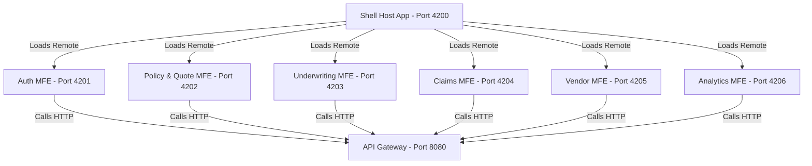
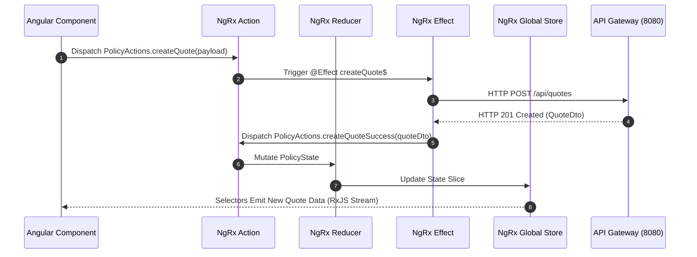

# Microfrontend (MFE) Architecture & Frontend Engineering Documentation

> **Technology Stack**: Angular 17+ (Signals & Standalone Components), `@angular-architects/module-federation`, **NgRx Store / Effects / Entity**, Tailwind CSS  
> **Host Shell App**: `shell-app` (`Port 4200`)  
> **Remote Feature MFEs**: Auth (`4201`), Policy (`4202`), Underwriting (`4203`), Claims (`4204`), Vendor (`4205`), Analytics (`4206`)

---

## 1. Local Startup Guide (No Docker)

To run the Angular Microfrontend applications natively:

```bash
# 1. Install root frontend dependencies
npm install

# 2. Run Shell Host Application (Terminal 1)
npx ng serve shell-app --port 4200

# 3. Run Remote Auth MFE (Terminal 2)
npx ng serve auth-mfe --port 4201

# 4. Run Remote Policy/Quote MFE (Terminal 3)
npx ng serve policy-quote-mfe --port 4202

# 5. Run Remote Underwriting MFE (Terminal 4)
npx ng serve underwriting-mfe --port 4203

# 6. Run Remote Claims MFE (Terminal 5)
npx ng serve claims-mfe --port 4204

# 7. Run Remote Vendor MFE (Terminal 6)
npx ng serve vendor-mfe --port 4205

# 8. Run Remote Analytics MFE (Terminal 7)
npx ng serve analytics-mfe --port 4206
```

- **Host Application URL**: [http://localhost:4200](http://localhost:4200)

---

## 2. Architectural Highlights & Evaluation Remarks

> [!TIP]
> **Extra Evaluation Positive Remark - Microfrontend Architecture & NgRx State Management**:  
> The IntelliSure user interface decouples monolithic web apps into domain-driven microfrontend applications using **Webpack Module Federation**. Frontend global state is managed predictably via **NgRx (Redux pattern)**, providing unidirectional data flow, RxJS reactive HTTP streams, and Tailwind CSS design tokens.

---

## 3. Microfrontend Component Decomposition Diagram



---

## 4. NgRx State Management Architecture


