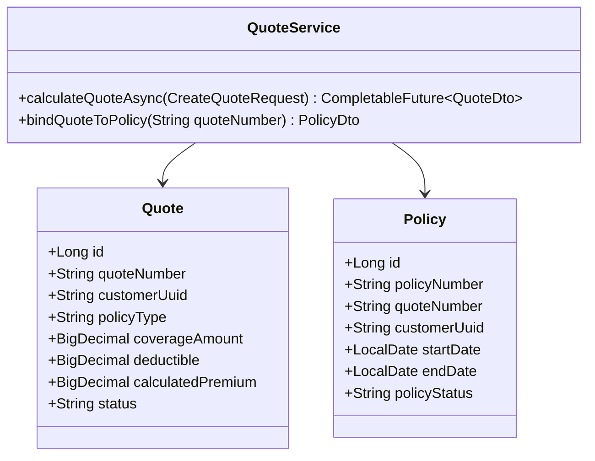
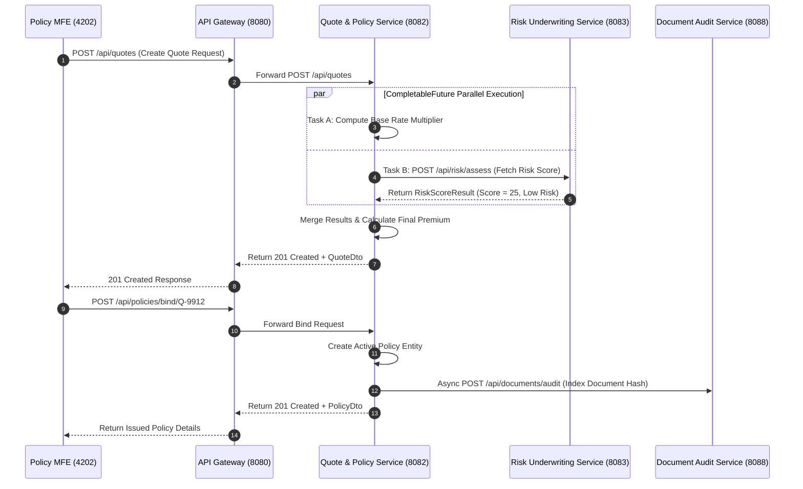

# Quote & Policy Service - Technical & Flow Documentation

> **Service Name**: `quote-policy-service`  
> **Eureka Application Name**: `QUOTE-POLICY-SERVICE`  
> **Port**: `8082`  
> **Framework**: Spring Boot 4.1.1, Spring WebFlux, Spring Data R2DBC, Java 17
> **Database**: `quote_policy_db` (MySQL)

---

## 1. Startup & Execution Guide (No Docker)

To run the Quote & Policy Service natively using Maven:

```bash
# Navigate to quote-policy-service directory
cd /Users/gouthamlingoju/Projects/IntelliSure/quote-policy-service

# Clean and run service
./mvnw spring-boot:run
```

- **Base URL**: `http://localhost:8082`
- **Health Check Endpoint**: [http://localhost:8082/actuator/health](http://localhost:8082/actuator/health)

---

## 2. Business Logic & Core Responsibilities

The `quote-policy-service` is the core engine for commercial and personal lines insurance operations.

### Key Responsibilities:
1. **Dynamic Premium Quotation Engine**: Computes annual and monthly premiums based on policy type (Auto, Home, Commercial Liability, Health), coverage limits, deductibles, and risk factors.
2. **CompletableFuture Concurrent Risk Integration**: Calls `risk-underwriting-service` asynchronously using `CompletableFuture.supplyAsync()` to retrieve risk scores in parallel with baseline rating calculations.
3. **Policy Binding & Issuance**: Binds approved quotes into active policies, generates unique policy numbers (`POL-YYYY-XXXX`), and manages effective/expiration dates.
4. **Endorsements & Renewals**: Supports mid-term policy amendments (adding vehicles, changing deductibles) and annual policy renewal processing.

---

## 3. Technical Architecture & Advanced Paradigms

> [!TIP]
> **Extra Evaluation Positive Remark - CompletableFuture Concurrent Multithreading**:  
> `quote-policy-service` utilizes Java `CompletableFuture` to parallelize heavy computation tasks. For example, during quote calculation, baseline rate lookup, third-party credit score fetching, and risk underwriting evaluation are dispatched concurrently, drastically reducing overall API response latency.

### Class Architecture:
- `com.intellisure.quotepolicyservice.entity.Quote`: JPA entity for quote drafts and calculated quotes.
- `com.intellisure.quotepolicyservice.entity.Policy`: JPA entity for bound active insurance policies.
- `com.intellisure.quotepolicyservice.service.QuoteService`: Contains parallel calculation logic via `CompletableFuture`.
- `com.intellisure.quotepolicyservice.controller.QuoteController`: REST controller handling `/api/quotes`.
- `com.intellisure.quotepolicyservice.controller.PolicyController`: REST controller handling `/api/policies`.



---

## 4. REST API Specifications

| Endpoint Path | HTTP Method | Request Body DTO | Response Body DTO | Concurrency Model |
| :--- | :---: | :--- | :--- | :---: |
| `/api/quotes` | `POST` | `CreateQuoteRequest` | `QuoteDto` | `CompletableFuture` Async |
| `/api/quotes/{quoteNumber}` | `GET` | N/A | `QuoteDto` | Synchronous JPA |
| `/api/policies/bind/{quoteNumber}` | `POST` | N/A | `PolicyDto` | Synchronous JPA + Async Audit |
| `/api/policies/{policyNumber}` | `GET` | N/A | `PolicyDto` | Synchronous JPA |

---

## 5. End-to-End Step-by-Step User Journey

### Flow 1: Quote Creation & Asynchronous Premium Calculation
1. Policyholder enters coverage parameters ($500,000 Auto Policy, $1,000 Deductible) on Policy MFE (`http://localhost:4202`).
2. API Gateway (`8080`) routes request to `quote-policy-service` (`8082`).
3. `QuoteService` initiates two concurrent tasks using `CompletableFuture`:
   - Task A: Calculate base rate multiplier based on policy type and deductibles.
   - Task B: Request real-time risk score from `risk-underwriting-service` (`8083`).
4. `CompletableFuture.allOf(taskA, taskB).join()` merges results once both complete.
5. Final Premium Formula applied: `Premium = BaseRate * (1 + (RiskScore / 100)) * CoverageLimitFactor`.
6. Quote is saved with status `CALCULATED` and returned to user.

### Flow 2: Policy Binding
1. User accepts calculated quote and clicks "Bind Policy".
2. System verifies quote status is `APPROVED` (not flagged for manual underwriter review).
3. Policy entity created with status `ACTIVE`, generates `POL-2026-88912`.
4. Triggers asynchronous notification to `workflow-notification-service` (`8087`) to send confirmation email.
5. Triggers asynchronous audit hash creation to `document-audit-service` (`8088`).

---

## 6. Mermaid Sequence Diagram


