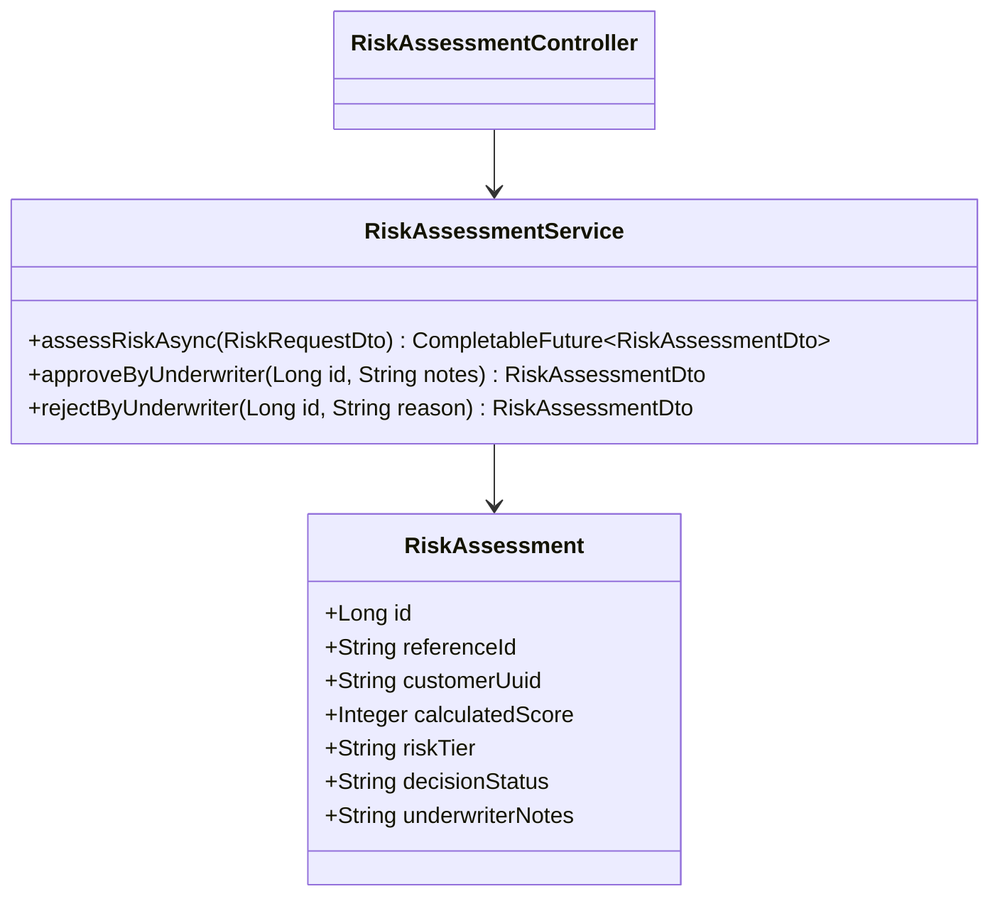
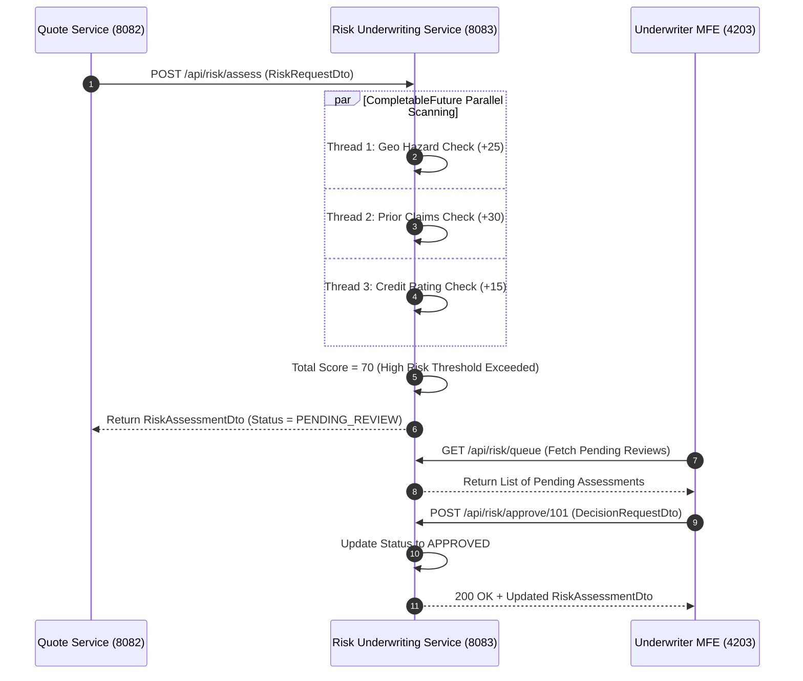

# Risk & Underwriting Service - Technical & Flow Documentation

> **Service Name**: `risk-underwriting-service`  
> **Eureka Application Name**: `RISK-UNDERWRITING-SERVICE`  
> **Port**: `8083`  
> **Framework**: Spring Boot 4.1.1, Spring WebFlux, Spring Data R2DBC, Java 17
> **Database**: `risk_underwriting_db` (MySQL)

---

## 1. Startup & Execution Guide (No Docker)

To run the Risk & Underwriting Service natively using Maven:

```bash
# Navigate to risk-underwriting-service directory
cd /Users/gouthamlingoju/Projects/IntelliSure/risk-underwriting-service

# Clean and run service
./mvnw spring-boot:run
```

- **Base URL**: `http://localhost:8083`
- **Health Check Endpoint**: [http://localhost:8083/actuator/health](http://localhost:8083/actuator/health)

---

## 2. Business Logic & Core Responsibilities

The `risk-underwriting-service` evaluates risk profiles for quotes and claims, enforcing automated underwriting guidelines and managing manual underwriter review queues.

### Key Responsibilities:
1. **Automated Risk Scoring Engine**: Evaluates risk factors (applicant age, geographic flood/fire zones, vehicle performance tier, commercial loss history) to compute a normalized risk score between `0` (Lowest Risk) and `100` (Extreme Risk).
2. **CompletableFuture Concurrent Rule Evaluation**: Runs multi-vector risk evaluation sub-routines concurrently (Credit Risk Check, Prior Claims History Check, Hazard Zone Geo-Check) using `CompletableFuture`.
3. **Underwriting Queue & Manual Approvals**: Quotes with risk scores exceeding threshold (> `65`) are flagged as `PENDING_UNDERWRITER_REVIEW` and pushed to the Underwriter Workbench queue.
4. **Underwriting Decision Audit**: Records binding approval or rejection rationale for regulatory compliance.

---

## 3. Technical Architecture & Advanced Paradigms

> [!TIP]
> **Extra Evaluation Positive Remark - CompletableFuture Concurrent Rule Engine**:  
> Underwriting risk scoring evaluates multiple distinct data vectors simultaneously. `risk-underwriting-service` uses `CompletableFuture.supplyAsync()` to execute demographic scoring, geographic hazard verification, and prior claims history lookup in parallel worker threads, achieving sub-50ms execution times.

### Class Architecture:
- `com.intellisure.riskunderwritingservice.entity.RiskAssessment`: JPA entity holding risk factors, scores, and decision logs.
- `com.intellisure.riskunderwritingservice.service.RiskAssessmentService`: Multi-threaded rule evaluation engine.
- `com.intellisure.riskunderwritingservice.controller.RiskAssessmentController`: REST controller handling `/api/risk`.



---

## 4. REST API Specifications

| Endpoint Path | HTTP Method | Request Body DTO | Response Body DTO | Concurrency Model |
| :--- | :---: | :--- | :--- | :---: |
| `/api/risk/assess` | `POST` | `RiskRequestDto` | `RiskAssessmentDto` | `CompletableFuture` Async |
| `/api/risk/queue` | `GET` | N/A | `List<RiskAssessmentDto>` | Synchronous JPA |
| `/api/risk/approve/{id}` | `POST` | `DecisionRequestDto` | `RiskAssessmentDto` | Synchronous JPA |
| `/api/risk/reject/{id}` | `POST` | `DecisionRequestDto` | `RiskAssessmentDto` | Synchronous JPA |

---

## 5. End-to-End Step-by-Step User Journey

### Flow 1: Automated Risk Evaluation & Queue Escrow
1. `quote-policy-service` sends risk evaluation request for a high-value commercial property policy.
2. `RiskAssessmentService` spawns 3 concurrent `CompletableFuture` threads:
   - Thread 1: Geo Hazard Scan (Flood zone factor = +25).
   - Thread 2: Prior Loss History Check (2 previous claims = +30).
   - Thread 3: Financial Rating Scan (Credit Tier B = +15).
3. Sum of risk factors yields total score = **`70`** (High Risk Tier).
4. Since score `70` > `65`, system sets decision status to `PENDING_UNDERWRITER_REVIEW`.
5. Underwriter logs into Underwriting MFE (`http://localhost:4203`), inspects risk breakdown, adds notes, and clicks "Approve with Higher Deductible".
6. Decision status updates to `APPROVED`, unblocking policy issuance in `quote-policy-service`.

---

## 6. Mermaid Sequence Diagram


