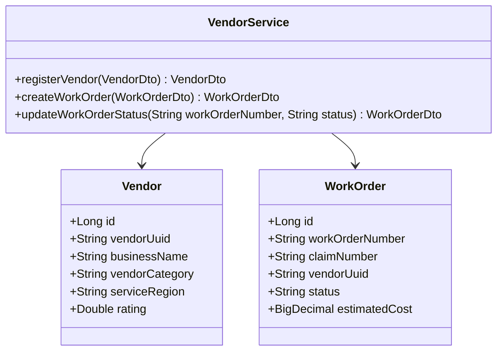
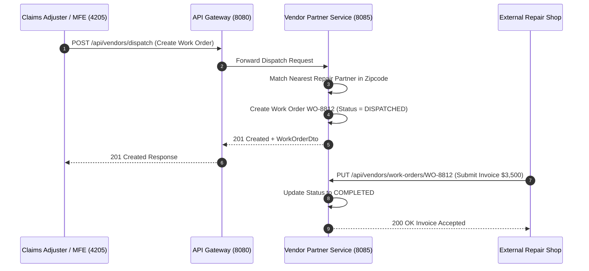

# Vendor & Partner Service - Technical & Flow Documentation

> **Service Name**: `vendor-partner-service`  
> **Eureka Application Name**: `VENDOR-PARTNER-SERVICE`  
> **Port**: `8085`  
> **Framework**: Spring Boot 3.x, Spring Data JPA, Java 17  
> **Database**: `vendor_partner_db` (MySQL)

---

## 1. Startup & Execution Guide (No Docker)

To run the Vendor & Partner Service natively using Maven:

```bash
# Navigate to vendor-partner-service directory
cd /Users/gouthamlingoju/Projects/IntelliSure/vendor-partner-service

# Clean and run service
./mvnw spring-boot:run
```

- **Base URL**: `http://localhost:8085`
- **Health Check Endpoint**: [http://localhost:8085/actuator/health](http://localhost:8085/actuator/health)

---

## 2. Business Logic & Core Responsibilities

The `vendor-partner-service` manages partner networks (Auto Repair Shops, Towing Operators, Medical Assessment Clinics, Property Restoration Contractors) and handles work order dispatching and vendor invoicing.

### Key Responsibilities:
1. **Vendor Onboarding & Tiering**: Registers third-party vendors, tracks service SLAs, certifications, and compliance metrics.
2. **Automated Repair & Dispatch Work Orders**: Receives dispatch requests from `claims-service` and routes work orders to nearby qualified repair partners.
3. **Vendor Invoicing & Service Fulfillment**: Allows vendors to upload work completion reports, itemized estimate costs, and final invoices.

---

## 3. Technical Architecture & Class Diagrams



---

## 4. REST API Specifications

| Endpoint Path | HTTP Method | Request Body DTO | Response Body DTO |
| :--- | :---: | :--- | :--- |
| `/api/vendors` | `POST` | `VendorDto` | `VendorDto` |
| `/api/vendors/dispatch` | `POST` | `CreateWorkOrderDto` | `WorkOrderDto` |
| `/api/vendors/work-orders/{workOrderNumber}` | `GET` | N/A | `WorkOrderDto` |

---

## 5. End-to-End Step-by-Step Dispatch Flow

1. Claims Adjuster approves claim `CLM-2026-4401` requiring roadside towing and body repair.
2. Adjuster dispatches work order via Vendor MFE (`http://localhost:4205`).
3. `vendor-partner-service` queries `vendor_partner_db` for active vendors in zipcode `90210`.
4. Dispatches Work Order `WO-8812` to "Precision Auto Repair".
5. Repair shop accepts work order, completes repairs, submits invoice for $3,500.
6. Work order status updated to `COMPLETED`, notifying `claims-service`.

---

## 6. Mermaid Sequence Diagram


