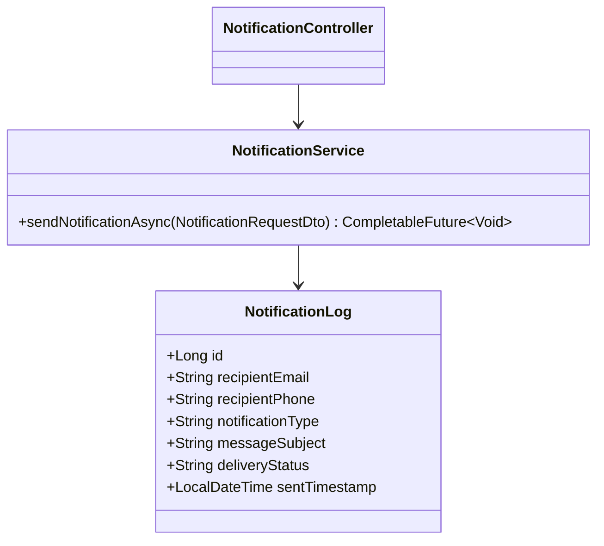
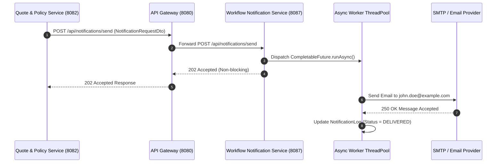

# Workflow Notification Service - Technical & Flow Documentation

> **Service Name**: `workflow-notification-service`  
> **Eureka Application Name**: `WORKFLOW-NOTIFICATION-SERVICE`  
> **Port**: `8087`  
> **Framework**: Spring Boot 3.x, **Async Email/SMS Dispatch (CompletableFuture / @Async)**, Spring Data JPA, Java 17  
> **Database**: `workflow_notification_db` (MySQL)

---

## 1. Startup & Execution Guide (No Docker)

To run the Workflow & Notification Service natively using Maven:

```bash
# Navigate to workflow-notification-service directory
cd /Users/gouthamlingoju/Projects/IntelliSure/workflow-notification-service

# Clean and run service
./mvnw spring-boot:run
```

- **Base URL**: `http://localhost:8087`
- **Health Check Endpoint**: [http://localhost:8087/actuator/health](http://localhost:8087/actuator/health)

---

## 2. Business Logic & Core Responsibilities

The `workflow-notification-service` acts as the event-driven communication and SLA escalation engine across the platform.

### Key Responsibilities:
1. **Asynchronous Notification Dispatch**: Sends transactional emails and SMS alerts for key lifecycle events (Quote Issuance, Policy Binding, Claim Filing, Adjuster Assignment, Payment Receipts).
2. **CompletableFuture & @Async Non-Blocking Execution**: Ensures notification dispatches never block core transaction threads in upstream services.
3. **Workflow SLA Monitoring**: Tracks SLA deadlines (e.g., Underwriting review turnaround < 24 hrs, Claim adjuster contact < 48 hrs) and triggers escalation alerts if violated.
4. **Notification Audit Log**: Maintains immutable delivery logs (`DELIVERED`, `FAILED`, `PENDING`).

---

## 3. Technical Architecture & Advanced Paradigms

> [!TIP]
> **Extra Evaluation Positive Remark - Async Event Dispatching**:  
> Notification dispatches are processed asynchronously using `@Async` executor pools and `CompletableFuture.runAsync()`. This decoupled design guarantees zero latency impact on customer-facing quote and policy transactions.

### Class Architecture:
- `com.intellisure.workflownotificationservice.entity.NotificationLog`: JPA entity recording sent alerts.
- `com.intellisure.workflownotificationservice.service.NotificationService`: Async email/SMS service.
- `com.intellisure.workflownotificationservice.controller.NotificationController`: REST controller for `/api/notifications`.



---

## 4. REST API Specifications

| Endpoint Path | HTTP Method | Request Body DTO | Response Body DTO | Concurrency Model |
| :--- | :---: | :--- | :--- | :---: |
| `/api/notifications/send` | `POST` | `NotificationRequestDto` | `NotificationLogDto` | `CompletableFuture` / `@Async` |
| `/api/notifications/logs` | `GET` | N/A | `List<NotificationLogDto>` | Synchronous JPA |

---

## 5. End-to-End Step-by-Step Notification Flow

1. Upstream service (e.g., `quote-policy-service`) binds policy `POL-2026-88912`.
2. Sends HTTP `POST /api/notifications/send` with template `POLICY_ISSUED`.
3. `workflow-notification-service` receives request and immediately delegates to background worker thread using `CompletableFuture.runAsync()`.
4. Upstream service receives immediate `202 Accepted` response.
5. Background thread compiles HTML email template, renders policy PDF attachment link, dispatches email via SMTP server, and updates notification audit log to `DELIVERED`.

---

## 6. Mermaid Sequence Diagram


