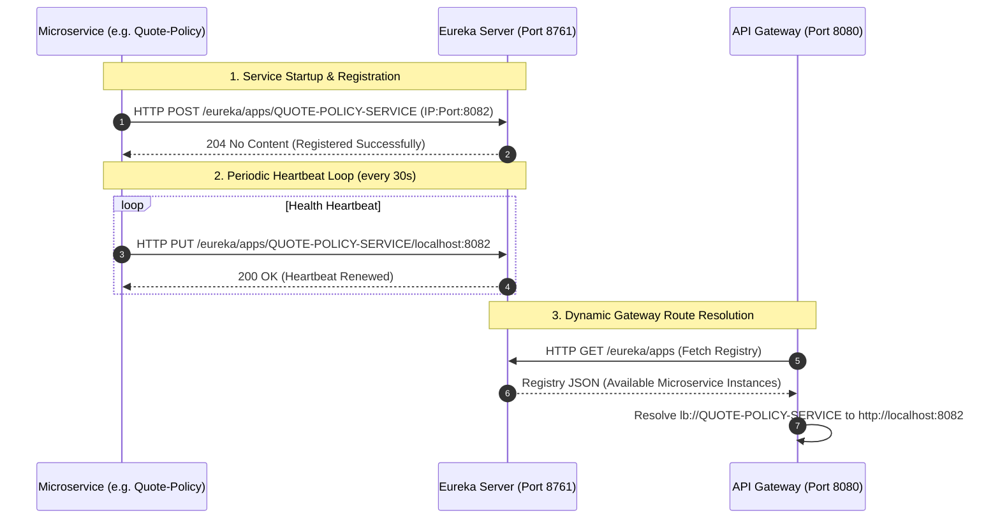
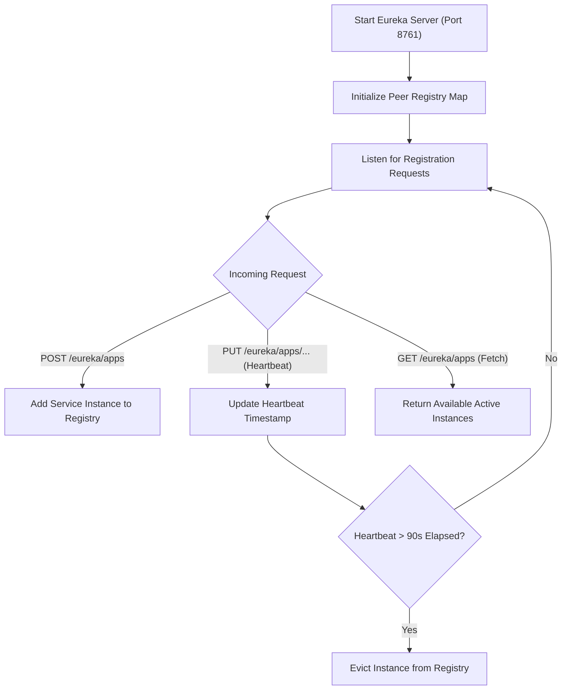

# Service Discovery Registry (`eureka`)

## 1. Overview & Service Responsibilities
The **Service Discovery Registry (`eureka`)** serves as the central registration server and lookup directory for the entire IntelliSure microservices ecosystem. Powered by **Spring Cloud Netflix Eureka Server**, it dynamically tracks all active microservice instances, their host IP addresses, operational ports, and health status indicators.

### Key Responsibilities:
- Centralized service registration and dynamic lookup.
- Real-time client heartbeats and instance health monitoring.
- High-availability peer awareness and client-side load balancer resolution (Ribbon/Spring Cloud LoadBalancer).
- Interactive Dashboard UI for system administrator monitoring at `http://localhost:8761`.

---

## 2. Environment & Startup Guide (No Docker)

### Prerequisites:
- JDK 17 or higher
- Maven 3.8+ (or bundled `./mvnw`)

### Configuration & Port Matrix:
- **Service Name**: `eureka`
- **Application Name**: `EUREKA-SERVER`
- **Port**: `8761`
- **Database Dependency**: None (In-memory registry)
- **Eureka Dashboard URL**: `http://localhost:8761`

### Application Configuration (`application.yaml`):
```yaml
server:
  port: 8761

spring:
  application:
    name: eureka

eureka:
  client:
    register-with-eureka: false
    fetch-registry: false
    service-url:
      defaultZone: http://localhost:8761/eureka/
  server:
    enable-self-preservation: false
    eviction-interval-timer-in-ms: 5000
```

### Individual Startup Command (No Docker):
```bash
cd eureka
./mvnw spring-boot:run
```

---

## 3. Business Logic & Registration Flows

When microservices (e.g. `customer-party-service`, `quote-policy-service`, `api-gateway`) start up:
1. The service reads its configured `eureka.client.service-url.defaultZone`.
2. It sends an HTTP `POST /eureka/apps/{APP_NAME}` payload containing its IP address, port, and health check URL.
3. Eureka registers the instance in its concurrent hash map registry.
4. The service sends heartbeat ping requests every 30 seconds (`POST /eureka/apps/{APP_NAME}/{INSTANCE_ID}`).
5. If Eureka fails to receive heartbeats for 90 seconds, the instance is evicted from the discovery registry.

---

## 4. User Journeys & UML Diagrams

### 4.1 System Registration & Lookup Sequence Diagram


### 4.2 Eureka Lifecycle Flowchart

